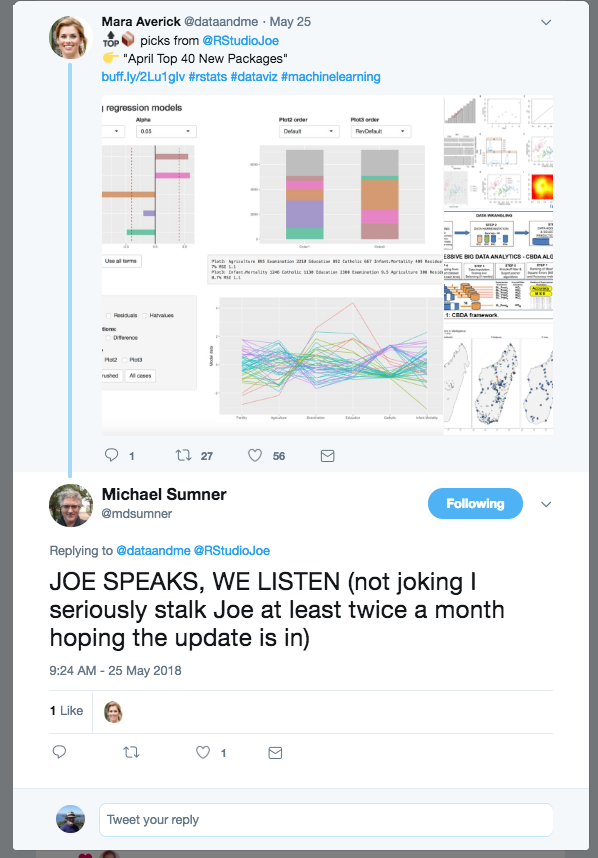
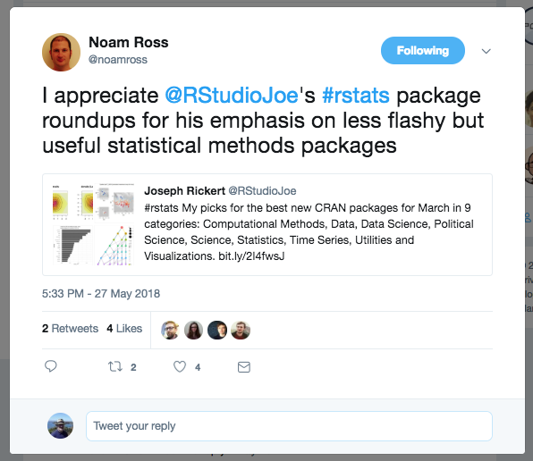
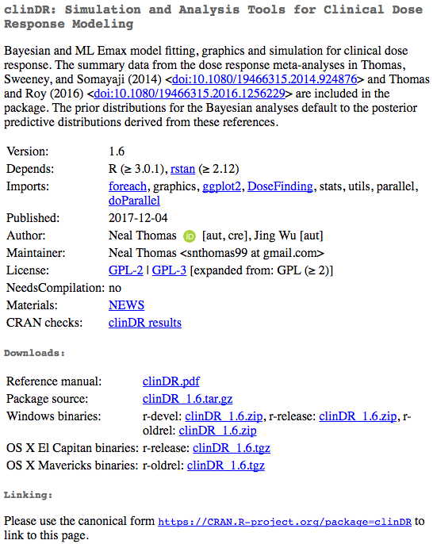

About 200 new packages arrive at CRAN each month and stick. I look at all of them, make my picks for the "Top 40" and blog about it on R Views:

https://rviews.rstudio.com/2018/05/24/april-2018-top-40-new-packages/

```{r, message=FALSE, warning=FALSE}
library(tidyverse)
library(lubridate)
np_df <- read.csv("New_Packages.csv",header=TRUE)
np_df <- mutate(np_df, Date = as.Date(Date,"%m/%d/%y"))
```


```{r}
p <- ggplot(np_df, aes(Date,Pkgs))
p + geom_bar(stat="identity") + 
    scale_x_date(date_labels = "%m %y") + 
    ggtitle("Number New Packages by Month")
```

   




### CRANberries

My main method of finding what's new is Dirk Eddelbuettel [CRANberries site](http://dirk.eddelbuettel.com/cranberries/).

At the beginning of every month, I scrape the site to find new packages added to CRAN during the previous month.

```{r, message=FALSE, warning=FALSE}
library(stringr)
# Read the raw data and write it to a tect file
url <- "http://dirk.eddelbuettel.com/cranberries/2018/04"
#browseURL(url)
raw_data <- readLines(url)

clean_df <- function(raw=raw_data){
  z <- grep("<b>New",raw_data,value=TRUE)
  zz <- str_replace_all(z,"\\\t|<a name=|><b>|</b></a>|\\\"|with initial version"," ")
  str_replace_all(zz,"^[^N]*"," ")
}


df <- clean_df()
head(df)
```

### Types of R Packages

By application domain: 

* Computational Methods    
* Data    
* Data Science    
* Machine Learning    
* Science     
* Statistics    
* Utilities    

By intended use:

* Public  
* Private  
   + Personal   
   + Professional  

### Professional Packages



#### Characteristics of Professional Packages
* References behind pay wall    
* No vignette    
* No README    
* Looks like quite a bit of work went into it    
   * Numerous functions    
   * Parallel execution    

### What am I looking for?

* Documentation   
   + Well-written descriptions in the pdf file
   + vignettes 
   + README and NEWS
   + Built-out websites
   + References
* A sense of how broad an audience it will attract
* A sense of excitement and craftsmanship

Selection Influencers    
* Inclusion in a [Task View](http://www.maths.lancs.ac.uk/~rowlings/R/TaskViews/)  
* An author with a track record


### Good R Packages:    

* Do something that people other than the author might consider useful      
* Offer enough functionality to make it worth remembering       
* Are well documented with both:   
   + Complete reference manuals that included references
   + README and NEWS files
   + Thoughtful vignettes   
* Work   
* Are well maintained   

### The Best R Packages:

* Are well written, tested and provide helpful messages 
* Have champions who actively promote, explain and teach their use   
* Are likely curated by others (R Task Views)   
* Used by other developers   

### Great R Packages:

* Add new functionality and capabilities    
* Develop new infrastructure   
* Improve performance    
* Change the way people think about R   
* Expand the reach of R  
* Do something beautiful


### My Picks for the R Package Hall of Fame


Package   | Year| Description                         | Author
----------|-----|-------------------------------------|-----------------    
caret     | 2007| A framework for predictive modeling | Kuhn et al.
bigmemory | 2008| Matrices in memory mapped files     | Kane ot al.
data.table| 2006| Fast, big data queries              | Dowle et al.
e1071     | 1999| Machine Learning                    | Meyer et al.
dplyr     | 2014| Tidy data manipulation              | Wickham et al.
foreach   | 2009| Parallel computing                  | Calaway & Weston
forecast  | 2009| Time series forecasting             | Hyndman et al.
ggplot2   | 2007| Plots and Visualizations            | Wickham & Cheng
glmnet    | 2008| lasso, elastic net regularization   | Freidman et al.
Hmisc     | 2003| 157 Misc data analysis & utilities  | Harrell et al.
knitr     | 2012| Literate programming                | Xie et al.
lme4      | 2003| GLM mixed-effects models            | Bates et al.
MASS      | 2009| Fundamental statistical functions   | Ripley et al.
Matrix    | 2000| Matrix Algebra                      | Bates et al.
Rcpp      | 2008| R interface to C++                  | Eddelbuettel et al.
rmarkdown | 2014| Reproducible research               | Allaire et al.
shiny     | 2012| Web apps & reactive programming     | Chang et al.
sp        | 2005| Spatial statistics                  | Pebesma et al.
XML       | 2000| Work with XML & HTML                | Temple Lang et al.
zoo       | 2004| Time Series                         | Zeileis et al.

### Contributions of Hall of Fame Packages

* To the R Language itself: data.table, XML, bigmemory
* To Statistics: lme4, sp, glmnet, Hmisc
* To Statistical computing: foreach, Rcpp, Matrix, MASS, zoo
* To the display of information: ggplot2
* To machine learning: caret, e1071, forecast
* To reproducible research and the "science of data science": dplyr, knitr, rmarkdown, shiny

### The Alternative to Great Packages

Systems of packages that work together:   
* [rOpenSci](https://ropensci.org/)    
* The [Tidyverse](https://www.tidyverse.org/)    


