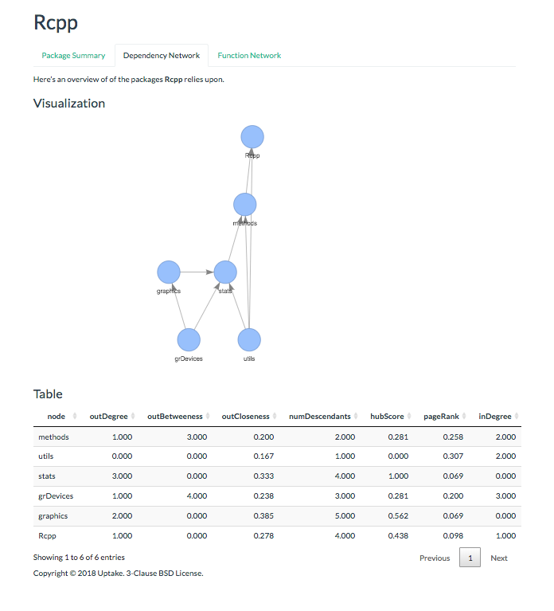
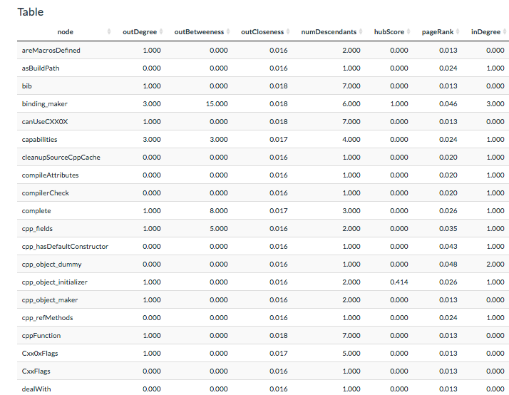

`pkgnet` was released to CRAN in April by Brian Burns, James Lamb, Patrick Boueri and Jay Qi. ( Note the R core document [Who Did What?](https://journal.r-project.org/archive/2012-1/RJournal_2012-1_Hornik~et~al.pdf) describes how to specify the roles of authors in R packages.)

The authors aim to provide tools quantify the complexity and vulnerability to failure of a software package by analyzing the dependencies between functions in an R package as well as its imported packages. There is some overlap with `cranly` but the focus is more on individual packages.

```{r, message=FALSE, warning=FALSE}
library(pkgnet)
```

The function `CreatepackageReport` creates a multi-tab html report.
```{r}
Rcpp_report <- CreatePackageReport(pkg_name = "Rcpp")
``` 

Here is a screen shot of the Dependency Network for `Rcpp`.



The following is part of Function Network for `Rcpp`.

  

### A Deeper Look

The package [vignette](https://cran.r-project.org/web/packages/pkgnet/vignettes/pkgnet-intro.html) describes how to examine code coverage for a package and discover functions within a package that share dependencies.

